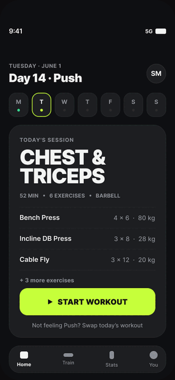
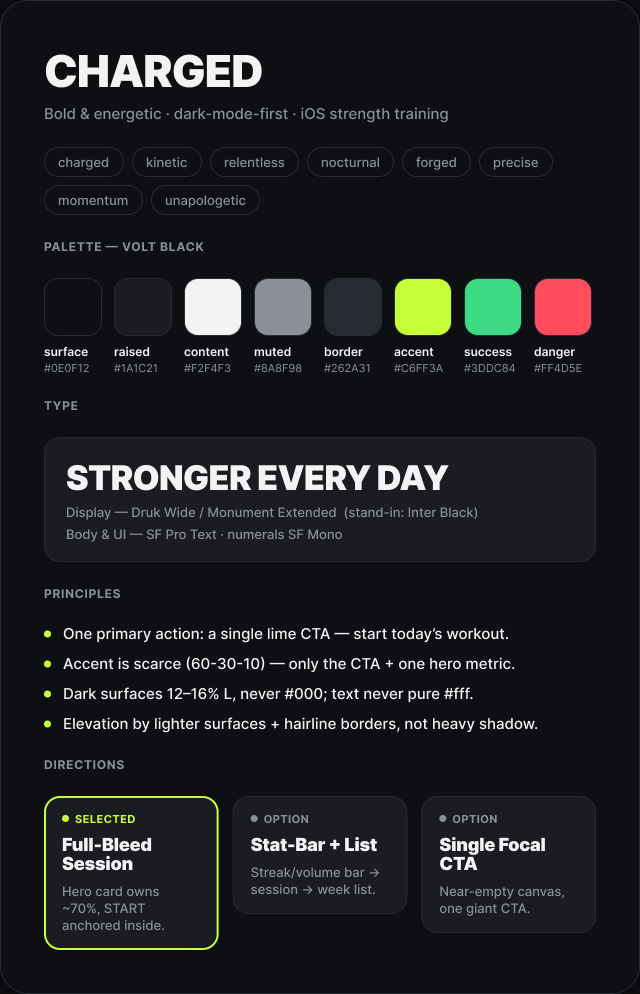
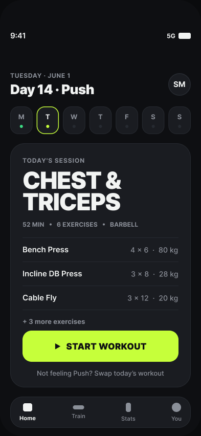
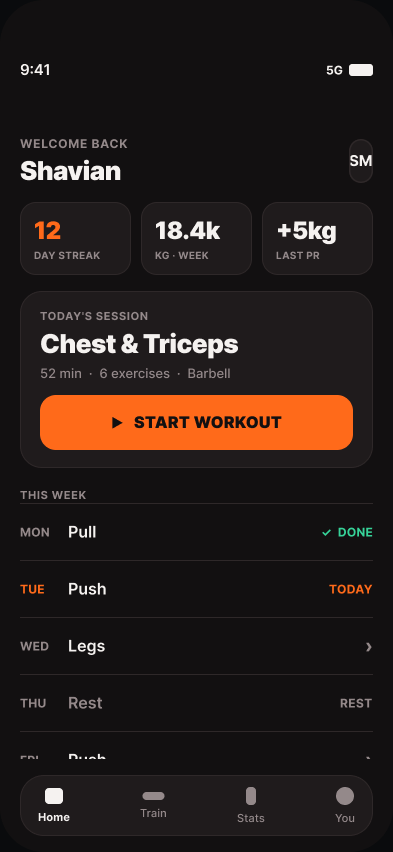
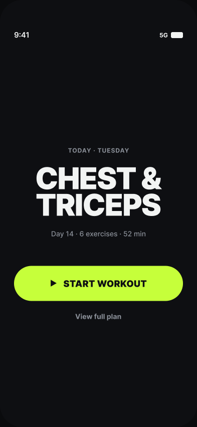

# Shavian UI Studio

**Created by Shavian Music (@shavianofficial).**

<p align="center">
  <a href="LICENSE"></a>
  
  
  
</p>

<p align="center">
  
</p>

Shavian UI Studio is a shareable Claude Code plugin for building a project-specific UI design brain before generating screens. It turns a vague visual request into a repeatable workflow:

1. inspect the current project;
2. ask a few sharp, adaptive questions and read your screenshots and sketches;
3. calibrate taste with positive and negative references;
4. run a parallel brainstorm and capture it as a mood board (Figma when connected, local HTML otherwise);
5. research shipped-product patterns with Mobbin when connected;
6. read and write native Figma structure when connected;
7. preserve approved decisions;
8. review screens independently and honestly;
9. verify implemented UI against golden screenshots;
10. learn your taste over time across every project.

The fastest way in is `/shavian-ui-studio:vision <your idea>` — it takes an idea in your head to a real screen with a few questions, references, and a mood board.

The plugin is designed for safe sharing. It ships with **no automatic hooks**, **no bundled MCP servers**, **no telemetry**, and **no secret collection**. External integrations are opt-in.

## Install

In Claude Code, run:

```text
/plugin marketplace add shalevshafian/shavian-ui-studio
/plugin install shavian-ui-studio@shavian-tools
```

Then start (or restart) a session and either describe what you want to build, or run:

```text
/shavian-ui-studio:vision <your idea>
```

Run `/shavian-ui-studio:doctor` anytime to check what's connected.

## Example output

A real run of `/shavian-ui-studio:vision "home page for a fitness app"` — a few sharp questions, a parallel brainstorm, an auto mood board, and three structurally distinct directions, all built natively in Figma.

**Auto-generated mood board**

<p align="center">
  
</p>

**Three distinct directions**

| Full-Bleed Session | Stat-Bar + List | Single Focal CTA |
|:---:|:---:|:---:|
|  |  |  |

## Quick local test

```bash
bash scripts/test-local.sh
```

## Install from this extracted folder

```bash
bash scripts/install-local.sh
```

Then start Claude Code inside a product project and run:

```text
/shavian-ui-studio:doctor
/shavian-ui-studio:bootstrap
```

## Optional integrations

Read `docs/INTEGRATIONS.md`, then run:

```bash
bash scripts/configure-integrations.sh
```

This script shows every command before it runs and asks for confirmation. It does not receive or store OAuth tokens.

## Publish for friends

Push this folder to a GitHub repository. Friends can add the marketplace and install the plugin:

```text
/plugin marketplace add YOUR_GITHUB_USERNAME/YOUR_REPOSITORY
/plugin install shavian-ui-studio@shavian-tools
```

After publishing a new release, update the version in:

```text
.claude-plugin/marketplace.json
plugins/shavian-ui-studio/.claude-plugin/plugin.json
CHANGELOG.md
```

## Plugin commands

```text
/shavian-ui-studio:doctor
/shavian-ui-studio:bootstrap
/shavian-ui-studio:vision      # idea → screen, fast
/shavian-ui-studio:research
/shavian-ui-studio:moodboard
/shavian-ui-studio:screen
/shavian-ui-studio:review
/shavian-ui-studio:lock
/shavian-ui-studio:taste
/shavian-ui-studio:sync-figma
/shavian-ui-studio:verify
```

## Trust model

Before installing any community plugin, inspect its scripts and manifests. This repository includes:

- `SECURITY.md`
- `PRIVACY.md`
- `docs/THREAT_MODEL.md`
- `scripts/smoke_test.py`
- `SHA256SUMS.txt`

Shavian UI Studio is an independent project. It is not affiliated with or endorsed by Anthropic, Figma, or Mobbin.
